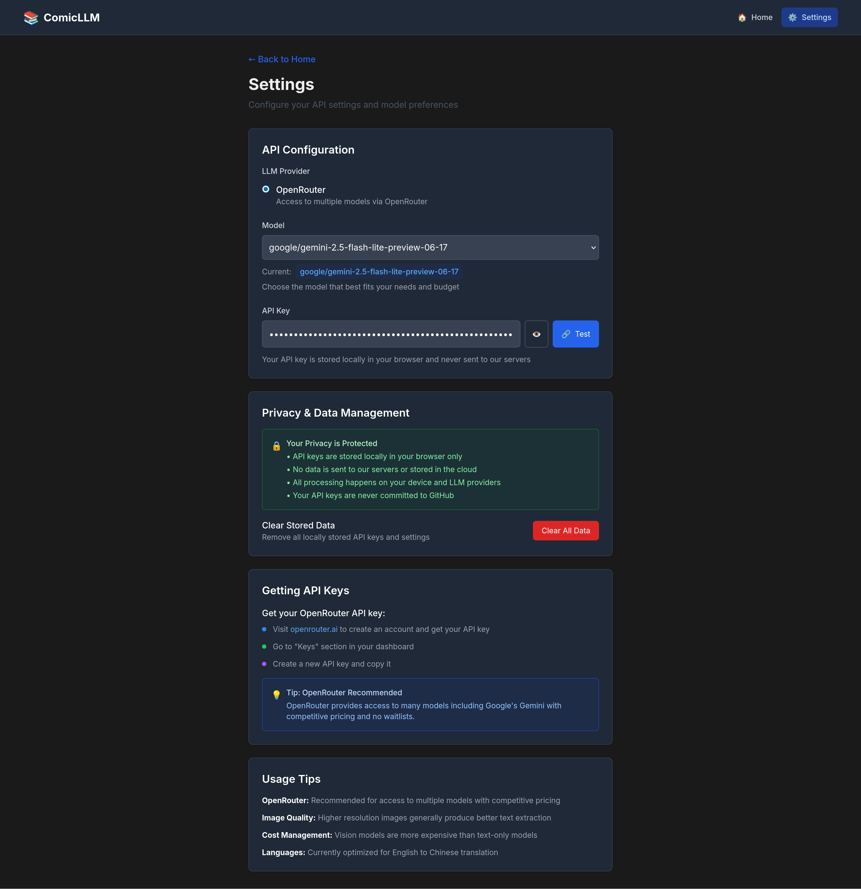

# ComicLLM 📚

A local comic text extraction and translation tool using Large Language Models (LLMs). Extract text from comic pages and translate English to Chinese with contextual explanations for language learning.


## ✨ Features

### Core Functionality
- 🎨 **Smart Text Extraction** - Uses vision-capable LLMs to identify and extract text in proper reading order
- 🌐 **Intelligent Translation** - English to Chinese translation with cultural context and explanations
- 📚 **Batch Processing** - Process multiple comic pages at once with smart ordering
- 🔄 **Progressive Display** - See results as each page completes processing
- 📤 **Multiple Export Formats** - Save translations as JSON, TXT, or Markdown

### User Experience
- 🔒 **Privacy First** - Fully local operation, your data never leaves your device
- 🌙 **Dark Mode** - Beautiful UI that adapts to your system theme
- 🎯 **Smart File Ordering** - Automatic filename-based sorting with manual reordering
- ⚡ **Unified Interface** - Single or multiple files handled seamlessly
- 💫 **Drag & Drop** - Intuitive file management and reordering

### Technical
- ⚡ **Easy Setup** - No complex configuration, just add your API key and start
- 💰 **Cost Effective** - Only pay for LLM API usage, no subscription fees
- 🔧 **Multiple Providers** - OpenRouter, OpenAI, and Anthropic support
- 🛡️ **Robust Error Handling** - Smart JSON parsing and connection testing

## 🚀 Quick Start

### 1. Clone and Install
```bash
git clone https://github.com/xcsnowcity/comicLLM
cd comicLLM
npm run install:all
```

### 2. Get an API Key
- **OpenRouter** (Recommended): Visit [openrouter.ai](https://openrouter.ai) 
- **OpenAI**: Visit [platform.openai.com](https://platform.openai.com/api-keys)
- **Anthropic**: Visit [console.anthropic.com](https://console.anthropic.com)

### 3. Run the Application
```bash
npm run dev
```
Open http://localhost:3000

### 4. Configure in Browser
1. Go to Settings page
2. Enter your API key
3. Test connection
4. Start processing comics!

## 🔧 Supported Providers & Models

| Provider | Models | Notes |
|----------|--------|-------|
| **OpenRouter** | Google Gemini 2.5 Flash Lite | Recommended for cost and performance |
| **OpenAI** | GPT-4V, GPT-4o | High quality but more expensive |
| **Anthropic** | Claude 3.5 Sonnet, Claude 3 Opus | Excellent for complex scenes |

## 📱 How It Works

1. **Upload Files** - Drag and drop single or multiple comic images (JPEG, PNG, GIF, WebP)
2. **Smart Ordering** - Automatic filename-based sorting or manual drag-and-drop reordering
3. **Batch Process** - LLM analyzes each image and extracts text in proper reading order
4. **Progressive Display** - See translations appear as each page completes processing
5. **Export Results** - Save your translations in JSON, TXT, or Markdown format

## 🛠 Development

### Prerequisites
- Node.js 18+
- npm or yarn
- LLM API key

### Available Scripts
```bash
# Development (both frontend and backend)
npm run dev

# Frontend only (port 3000)
npm run dev:frontend

# Backend only (port 3001)  
npm run dev:backend

# Build for production
npm run build

# Start production servers
npm run start
```

### Project Structure
```
comicLLM/
├── frontend/           # Next.js app
├── backend/           # Express API server
├── storage/           # Local file storage
├── config/           # Configuration files
└── CLAUDE.md         # Development reference
```

## 📸 Screenshots

### Main Interface
Upload single or multiple comic pages with smart ordering and drag-and-drop reordering.


### Batch Processing
Process multiple pages with progressive display and status tracking.


### Text Extraction Results
Clean display of extracted text with translations and cultural explanations.


### Settings Page
Simple configuration with API key management and connection testing.


## 🌟 Roadmap

### ✅ Completed
- [x] **Export Functionality** - Save translations as JSON, TXT, Markdown
- [x] **Batch Processing** - Process multiple pages at once with smart ordering
- [x] **Unified Interface** - Single mode supporting both single and multiple files
- [x] **Drag & Drop Reordering** - Manual page ordering with visual feedback
- [x] **Progressive Display** - Real-time results as pages complete
- [x] **Smart File Sorting** - Automatic filename-based ordering
- [x] **Robust Error Handling** - Improved JSON parsing and connection testing

### 🚧 In Progress
- [ ] **Session Management** - Save and resume processing sessions

### 📋 Planned
- [ ] **Translation Editing** - Manual correction capabilities
- [ ] **Multi-language Support** - Support for other language pairs
- [ ] **Archive Support** - Direct CBR/CBZ file processing
- [ ] **Performance Optimization** - Enhanced processing for large batches

## 🤝 Contributing

Contributions are welcome! Please read [CLAUDE.md](./CLAUDE.md) for development guidelines.

1. Fork the repository
2. Create a feature branch
3. Make your changes
4. Test thoroughly
5. Submit a pull request

## 📄 License

MIT License - see [LICENSE](LICENSE) file for details.

## 🙏 Acknowledgments

- Thanks to the teams at OpenAI, Anthropic, and OpenRouter for providing excellent API services
- Built with Next.js, Express, and Tailwind CSS

---

**Note**: This tool is designed for personal use and language learning. Please respect copyright laws when processing comic content.