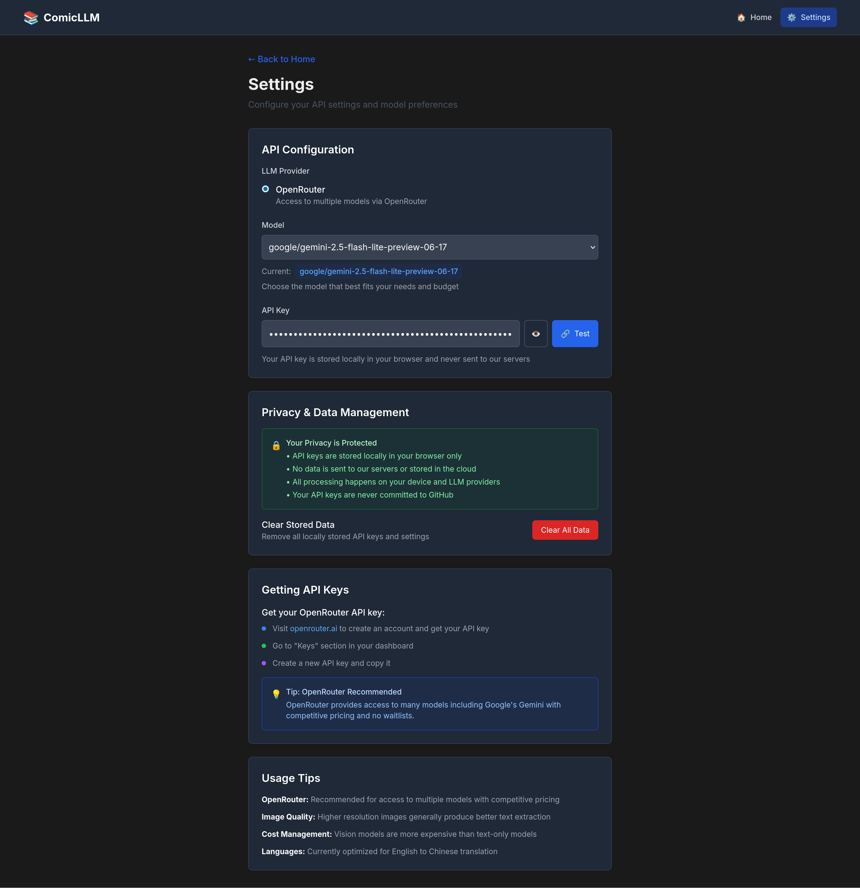

# ComicLLM 📚

[English](README.md) | **中文**

使用大语言模型（LLMs）的本地漫画文本提取和翻译工具。从漫画页面中提取文本并将英文翻译成中文，提供语境解释以促进语言学习。


## ✨ 功能特性

### 核心功能
- 🎨 **智能文本提取** - 使用视觉能力的LLM按正确阅读顺序识别和提取文本
- 🌐 **智能翻译** - 英文到中文翻译，提供文化背景和解释
- 📚 **漫画书管理** - 将翻译整理到会话中，并跟踪进度
- 🔄 **翻译历史** - 查看和浏览所有已翻译的页面
- 📤 **多种导出格式** - 将翻译保存为JSON、TXT或Markdown格式

### 用户体验
- 🌍 **多语言界面** - 完整的中文和英文UI支持，可即时切换
- 🔒 **隐私优先** - 完全本地操作，您的数据不会离开您的设备
- 🌙 **深色模式** - 适应系统主题的美观UI
- 🎯 **智能文件排序** - 基于文件名的自动排序或手动拖放重排
- ⚡ **统一界面** - 无缝处理单个或多个文件
- 💫 **拖拽功能** - 直观的文件管理和重排序

### 技术特性
- ⚡ **简单设置** - 无需复杂配置，只需添加API密钥即可开始
- 💰 **成本效益** - 仅支付LLM API使用费用，无订阅费
- 🔧 **多个提供商** - 支持OpenRouter、OpenAI和Anthropic
- 🛡️ **强大的错误处理** - 智能JSON解析和连接测试

## 🚀 快速开始

### 1. 克隆并安装
```bash
git clone https://github.com/xcsnowcity/comicLLM
cd comicLLM
npm run install:all
```

### 2. 获取API密钥
- **OpenRouter**（推荐）：访问 [openrouter.ai](https://openrouter.ai) 
- **OpenAI**：访问 [platform.openai.com](https://platform.openai.com/api-keys)
- **Anthropic**：访问 [console.anthropic.com](https://console.anthropic.com)

### 3. 运行应用程序
```bash
npm run dev
```
打开 http://localhost:3000

### 4. 在浏览器中配置
1. 进入设置页面
2. 输入您的API密钥
3. 测试连接
4. 开始处理漫画！

## 🔧 支持的提供商和模型

| 提供商 | 模型 | 说明 |
|----------|--------|-------|
| **OpenRouter** | Google Gemini 2.5 Flash Lite | 推荐用于成本和性能平衡 |
| **OpenAI** | GPT-4V, GPT-4o | 高质量但更昂贵 |
| **Anthropic** | Claude 3.5 Sonnet, Claude 3 Opus | 擅长处理复杂场景 |

## 📱 工作原理

1. **创建漫画书** - 开始新的漫画书会话或继续现有会话
2. **上传文件** - 拖放单个或多个漫画图像（JPEG、PNG、GIF、WebP）
3. **智能排序** - 基于文件名的自动排序或手动拖放重排
4. **批量处理** - LLM分析每个图像并按正确阅读顺序提取文本
5. **查看翻译** - 使用增强导航浏览所有翻译页面
6. **导出结果** - 将翻译保存为JSON、TXT或Markdown格式

## 🛠 开发

### 前置要求
- Node.js 18+
- npm 或 yarn
- LLM API密钥

### 可用脚本
```bash
# 开发（前端和后端）
npm run dev

# 仅前端（端口3000）
npm run dev:frontend

# 仅后端（端口3001）
npm run dev:backend

# 生产构建
npm run build

# 启动生产服务器
npm run start
```

### 项目结构
```
comicLLM/
├── frontend/           # Next.js应用
├── backend/           # Express API服务器
├── storage/           # 本地文件存储
├── config/           # 配置文件
└── CLAUDE.md         # 开发参考
```

## 📸 截图

### 主界面
上传单个或多个漫画页面，支持智能排序和拖放重排。


### 批量处理
处理多个页面，实时显示进度和状态跟踪。


### 文本提取结果
清晰显示提取的文本、翻译和文化解释。


### 设置页面
简单配置，包含API密钥管理和连接测试。


## 🌟 发展路线

### ✅ 已完成
- [x] **多语言界面** - 完整的中文和英文UI支持
- [x] **漫画书管理** - 基于会话的组织和进度跟踪
- [x] **翻译历史** - 增强的页面跳转导航
- [x] **导出功能** - 保存翻译为JSON、TXT、Markdown
- [x] **批量处理** - 一次处理多个页面，支持智能排序
- [x] **统一界面** - 支持单个和多个文件的单一模式
- [x] **拖放重排** - 手动页面排序，带有视觉反馈
- [x] **渐进式显示** - 页面完成时的实时结果
- [x] **智能文件排序** - 基于文件名的自动排序
- [x] **强大的错误处理** - 改进的JSON解析和连接测试

### 📋 计划中
- [ ] **翻译编辑** - 手动修正功能
- [ ] **多语言支持** - 支持其他语言对
- [ ] **存档支持** - 直接处理CBR/CBZ文件
- [ ] **性能优化** - 增强大批量处理能力

## 🤝 贡献

欢迎贡献！请阅读 [CLAUDE.md](./CLAUDE.md) 了解开发指南。

1. Fork仓库
2. 创建功能分支
3. 进行更改
4. 彻底测试
5. 提交拉取请求

## 📄 许可证

MIT许可证 - 详见 [LICENSE](LICENSE) 文件。

## 🙏 致谢

- 感谢OpenAI、Anthropic和OpenRouter团队提供优秀的API服务
- 使用Next.js、Express和Tailwind CSS构建

---

**注意**：此工具专为个人使用和语言学习而设计。处理漫画内容时请遵守版权法。